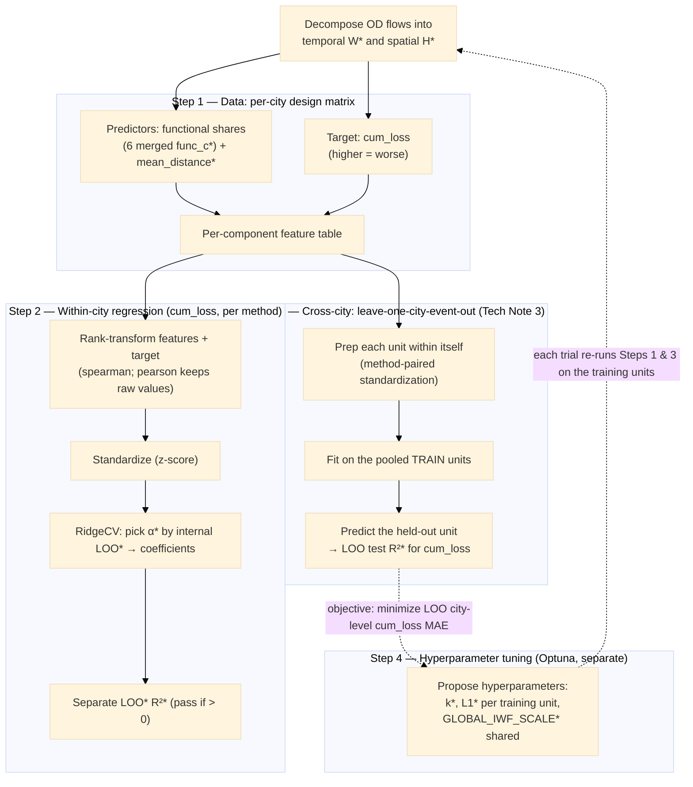

# Technical Note — Resilience Regression

## Overview

Terms marked `*` in the diagram:

- **W**, **H** — the two NMF factors: `W` is the temporal factor (each
  component's activity over time), `H` the spatial factor (each component's
  origin–destination flow map).
- **`func_c`** — the merged functional share of functional category *c*
  (`share_from_c` + `share_to_c`): the total share of a component's flow touching
  that category.
- **`mean_distance`** — a component's loading-weighted average origin→destination
  flow distance (km).
- **leave-one-out (LOO)** — hold out one component, predict it from all the
  others, repeat for every component, then measure how close the predictions are;
  a small-sample way to check the model without a separate test set.
- **α** — the ridge penalty strength (regularization); `RidgeCV` selects it
  automatically.
- **R²** — out-of-sample coefficient of determination (the "test score"):
  1 = perfect, 0 = no better than predicting the mean, negative = worse.
- **Hyperparameters** — `k` = number of components; `L1` = sparsity penalty on
  the factors; `GLOBAL_IWF_SCALE` = the exponent of the pooled TF-IWF weights
  behind the land-use classification that generates the functional predictors
  (see §1).

## 1. Data — the design matrix

**(a) Target.** The single resilience metric **`cum_loss`**: the NET,
unclipped cumulative deviation of a component's relative daily activity curve
`r(d)` from its pre-disaster baseline over the disaster window,

$$
\text{cum\_loss} \;=\; \sum_d \bigl(1 - r(d)\bigr),
$$

measured in day-equivalents and oriented HIGHER = WORSE.  Because the sum is
unclipped, above-baseline surges cancel below-baseline drops: a positive value
is a net loss and a negative value a net gain, and the metric stays linear
(additive) across components.  Four further metrics (`drop_depth`,
`early_collapse`, `recovery_day`, `recovery_deficit`) were retired from every
analysis, figure and output CSV on 2026-07-12
(`RES_COLS = ['cum_loss']`, `run_pattern_nmf.py:305`); they remain computed by
`resilience_features` in `utils/pattern_analysis/component_features.py` so
that any of them can be restored by adding its name back to `RES_COLS`.

**(b) Predictors.** Functional shares + one spatial feature:

- **Functional** — the per-component shares over the six land-use categories.
  The underlying block-group labels come from the pipeline's **single global
  land-use classification** (`_global_landuse_classification` in
  `run_pattern_nmf.py`): the TF-IWF rarity weights are computed once from one
  score pool spanning **all five city-events'** block groups (exponent
  `GLOBAL_IWF_SCALE = 1.52`), and every city is classified with that same
  weight vector — the identical recipe the cross-city prediction step uses
  (the notes call it "config C"; the earlier per-city recipe, in which each
  city was classified with its own rarity weights, was removed).  The
  classification is therefore transductive: the pooled weights depend on the
  whole city-event registry (land-use features only, never resilience labels),
  so adding or removing a city-event shifts every unit's labels — and hence
  these predictors — slightly.  Whether the shares enter merged or directional
  is controlled by the `run_pattern_nmf.py` flag `MERGE_FUNC_DIRECTIONS`
  (default `True`):
  - `True` uses the **6 merged** per-function shares
    `func_c = share_from_c + share_to_c`. Six predictors.
  - `False` uses the **12 directional** shares (`share_from_<c>`,
    `share_to_<c>`) as-is. Twelve predictors.
  - Merging halves the predictor count for the small per-city `n`. `n` = the
    number of components surviving the `dropna` over the features and
    `cum_loss`; it differs by city-event and is small (9–11 in the current
    five-event runs).
- **Spatial** — `mean_distance` appended as the final predictor (so the design
  matrix has **7 columns merged, 13 unmerged**).

### 1.1 The spatial feature `mean_distance`

Built in two steps — a per-flow distance array, then a per-component
loading-weighted mean.

**(a) Per-flow OD distances**. Each NMF flow
`j` (a column of the spatial factor `H`) is an origin→destination block-group
pair. The block-group polygon centroids are
projected to **EPSG:3857 (Web Mercator)** and

$$
d_j \;=\; \frac{\lVert \text{centroid}(\text{origin}_j) - \text{centroid}(\text{dest}_j) \rVert_2}{1000}\quad(\text{km}),
$$

aligned to `H`'s column order. A missing centroid for any endpoint raises (no
silent gap). 

**Caveat:** 
 - Web Mercator inflates absolute distance by
≈ 1∕cos(latitude); within one city that factor is ~constant, so cross-flow /
cross-component comparisons *within a city* are unaffected — and the rank
transform in §2 removes a constant per-feature scale entirely.
 - Distance based on centroid may not represent real mobility distance, because travels do not distribute evenly in each block group. And some block groups have very non-convex shape.

**(b) Per-component loading-weighted mean**.
Component `i`'s flow map is `H[i, :]` (non-negative loadings over flows), so its
typical flow length — stored as `mean_distance[i]` — is the loading-weighted
average distance:

$$
\bar d_i \;=\; \frac{\sum_j H[i,j]\, d_j}{\sum_j H[i,j]}
$$

High `mean_distance` = a long-range component; low = a local one.

## 2. Modelling — the rank-Ridge regression

The pipeline runs the within-city regression once per method
(`RESIL_REG_METHODS` in `run_pattern_nmf.py`): the `spearman` method
rank-transforms the features and the target before the fit, while the
`pearson` method regresses the raw standardized values.  Each method writes
its own `intra_city_loss_reg_<method>/` folder under
`outputs/nmf/resilience_corr/func_vs_resilience/`.  Each method fits **one
model per city-event**, with `cum_loss` as the target; for that fit
`fit_resilience_linear` (in `utils/pattern_analysis/ml_resilience.py`) does,
**in order**:

**(a) Rank-transform** (the `spearman` method; the `pearson` method skips this
step). Each predictor column **and** the
target are replaced by their ranks, computed **globally over the city's components**. This makes the
fit Spearman-aligned (Spearman = Pearson on ranks).

**(b) Standardize.** The target `y` is z-scored (mean 0, sd 1, `ddof=0`,
with a `sd=0 → 1` guard); the predictor matrix `X` is standardized by
`StandardScaler` (`ddof=0`). 

**(c) Fit.**
`RidgeCV` picks `alpha` by its **efficient internal leave-one-out (LOO)** on
the full city data. `RIDGE_ALPHAS = np.logspace(-3, 3, 13)` (13 candidate penalties, 1e-3 … 1e3).

**(d) Separate generalisation check (LOO R²).** Independently of alpha selection,
Leave-one-**component**-out predictions, and `loo_r2 = r2_score(y, y_pred)`.
`passed = (loo_r2 > 0)` — i.e. beats predicting the mean
(the mean rank on the `spearman` path, the mean value on the `pearson` path).

### 2.1 Current within-city results (five city-events, global land-use recipe)

The table below shows the LOO R² of the `cum_loss` regression on both method
paths, read from
`intra_city_loss_reg_<method>/raw_data/linear_loo_summary_baseline_<code>.csv`
(a positive value passes the check):

| method | BR_Ida (n=11) | FM_Ian (n=11) | WM_Dorian (n=9) | WM_Isaias (n=9) | LC_Laura (n=10) |
|---|---|---|---|---|---|
| rank (`spearman`) | −0.04 | **0.55** | **0.32** | **0.70** | **0.16** |
| raw (`pearson`) | −0.21 | **0.40** | **0.46** | **0.16** | **0.88** |

`cum_loss` passes in four of the five city-events on both paths; BR_Ida is
the only failure, and it fails on both.  Before the 2026-07-12 retirement the
same runs also scored the four retired metrics, and none of them passed as
consistently as `cum_loss` (`early_collapse`, the weakest, failed in every
city-event on the raw-value path), which is part of why `cum_loss` was kept
as the sole target.  These figures reflect the global classification recipe
of §1; the per-city-recipe results reported before 2026-07-12 are superseded.

## 3. Cross-city generalisation

Five city-events (BR_Ida, FM_Ian, WM_Dorian, WM_Isaias, LC_Laura) now enter
the cross-city step, which runs a **leave-one-city-event-out** design — each
unit takes a turn as the held-out test set while the model is fit on the four
pooled remaining units — plus a pairwise single-train to single-test
comparison.  The full design (the two method-paired standardization frames,
the cosine-kNN transfer model selected by `CROSS_CITY_MODEL`, the fixed
test-role k = 10, and the city-level `cum_loss` reconstruction) is documented
in Technical Note 3 on cross-city resilience prediction; this section keeps
only the preparation step that the within-city regression shares
(`cross_city_resilience` in `utils/pattern_analysis/ml_resilience.py`).

**Prepare each unit on its own.** Drop components with any missing feature or
missing `cum_loss`; if fewer than 8 usable components remain — or the target
is constant — that unit is skipped.  On the rank (`spearman`) path the
surviving features **and** the target are rank-transformed and then
standardized **separately within each city-event**: this is the level-robust
step, in which ranking and standardizing each unit in itself puts all units on
a common scale, so the absolute-level differences between the disasters are
normalised away before anything is transferred.  On the raw-value (`pearson`)
path the pooled features and the target are instead standardized on the pooled
training units, so each city's absolute level survives the transfer.

## 4. Hyperparameter tuning

A **separate** Optuna script (`tune_nmf_optuna.py`, not part of a normal
pipeline run) searches the NMF and land-use hyperparameters by
leave-one-city-event-out cross-validation **inside the training split only**:
the four training units (FM_Ian, WM_Dorian, WM_Isaias, LC_Laura) take turns as
the validation fold, and the held-out test unit (BR_Ida) is never loaded.

**(a) What is tuned.** Per training city-event, two knobs:

- `n_behaviors` (k, 8–25) — the number of NMF components the city's mobility is
  decomposed into; also the number of per-component rows the regression sees.
- `l1_reg` (0–2.0) — the L1 sparsity penalty on the NMF factors W and H; higher
  pushes each component onto fewer OD flows (sparser, cleaner patterns).

One knob is global: `GLOBAL_IWF_SCALE` (0–3.0), the exponent of the pooled
TF-IWF weights behind the land-use classification of §1 — so the tuner does
search the land-use recipe, though only within the training pool.  Everything
else is fixed at the production values: OD filtering is disabled
(`filter_factor = 0` for every unit), the context-aware solver is off, and the
transfer itself (the model, the standardization frames, the level and pooled
feature columns, and the test-role k) is not searched.

**(b) Objective.** Minimise the **city-level `cum_loss` mean absolute error**
over the validation folds: for each held-out training unit, the city's
`cum_loss` is reconstructed from the transferred component predictions (the
component-wise or the city-wise reconstruction, chosen by `--method`) and
compared to the ground truth from the city's total-activity curve.

**(c) Known weakness.** The validation set is tiny (four folds), so the
objective is noisy and prone to overfitting: the 2026-07-07 attempt to tune
`GLOBAL_IWF_SCALE` on this objective improved the four-fold validation but
worsened the five-city production reconstruction and was reverted, so
production keeps the untuned `GLOBAL_IWF_SCALE = 1.52`.

## 5. Caveats found during development

**(a)** `n` per city is small (the component count, 9–11 in the current runs).
With merged features `p = 7`; **unmerged `p = 13`** now exceeds `n`, so the
unmerged mode is markedly more overfit-prone — the default
`MERGE_FUNC_DIRECTIONS = True` exists for this.

**(b) Collinearity from compositional features.** Coefficient values are not stable 
and therefore **signs can flip across cities**. My major takeaway is that when entering the regression, coefficients are not interpretable in terms of their relationship to resilience.

**(c) LOO optimism.** Ranking is global over the city's components and `alpha` is
selected on the full city data then reused in each fold — a mild in-sample
optimism, so `loo_r2` is a small-sample hint, not proof.

**(d) No component correspondence.** Each city-event comes from its **own** NMF
decomposition, so there is no matching of one unit's components to another
unit's; the transfer works only if the *marginal* feature-to-resilience rank
relationship is shared across the decompositions.

**(e) Model selection now stays inside the training split, but the validation
is small.** Earlier versions tuned the hyperparameters on the very cross-city
score that was then reported.  The current tuner (§4) removes that circularity
structurally — BR_Ida is held out and never loaded during tuning — yet each
objective value rests on only four validation folds, and the one attempt to
tune `GLOBAL_IWF_SCALE` on this objective overfit it and had to be reverted.
Small-fold tuning results should therefore not be trusted without a check on
the full five-city production run.
