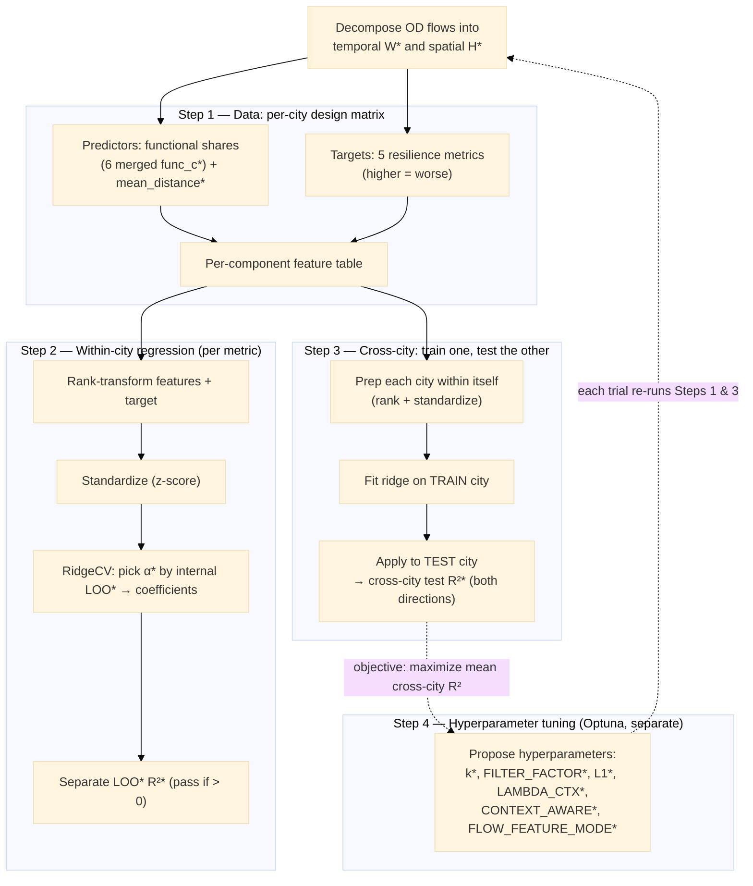

# Technical Note — Resilience Regression

## Overview

Terms marked `*` in the diagram:

- **W**, **H** — the two NMF factors: `W` is the temporal factor (each
  component's activity over time), `H` the spatial factor (each component's
  origin–destination flow map).
- **`func_c`** — the merged functional share of functional category *c*
  (`share_from_c` + `share_to_c`): the total share of a component's flow touching
  that category.
- **`mean_distance`** — a component's loading-weighted average origin→destination
  flow distance (km).
- **leave-one-out (LOO)** — hold out one component, predict it from all the
  others, repeat for every component, then measure how close the predictions are;
  a small-sample way to check the model without a separate test set.
- **α** — the ridge penalty strength (regularization); `RidgeCV` selects it
  automatically.
- **R²** — out-of-sample coefficient of determination (the "test score"):
  1 = perfect, 0 = no better than predicting the mean, negative = worse.
- **Hyperparameters** — `k` = number of components; `FILTER_FACTOR` =
  low-activity OD-flow filter; `L1` = sparsity penalty on the factors;
  `LAMBDA_CTX` = context strength; `CONTEXT_AWARE` = use functional context
  (on/off); `FLOW_FEATURE_MODE` = geometry of the context feature.

## 1. Data — the design matrix

**(a) Targets.** The five resilience metrics
(`drop_depth`, `early_collapse`,
`recovery_day`, `recovery_deficit`, `cum_loss`), all oriented HIGHER = WORSE.
Each is regressed **separately**.

**(b) Predictors.** Functional shares + one spatial feature:

- **Functional** — controlled by the config flag `MERGE_FUNC_DIRECTIONS`
  (default `True`):
  - `True` → the **6 merged** per-function shares
    `func_c = share_from_c + share_to_c`. Six predictors.
  - `False` → the **12 directional** shares (`share_from_<c>`, `share_to_<c>`)
    used as-is. Twelve predictors.
  - Merging halves the predictor count for the small per-city `n`. `n` = the number of components surviving the per-metric `dropna`; it
differs by city and is small (order 10–25).
- **Spatial** — `mean_distance` appended as the final predictor (so the design
  matrix has **7 columns merged, 13 unmerged**).

### 1.1 The spatial feature `mean_distance`

Built in two steps — a per-flow distance array, then a per-component
loading-weighted mean.

**(a) Per-flow OD distances**. Each NMF flow
`j` (a column of the spatial factor `H`) is an origin→destination block-group
pair. The block-group polygon centroids are
projected to **EPSG:3857 (Web Mercator)** and

$$
d_j \;=\; \frac{\lVert \text{centroid}(\text{origin}_j) - \text{centroid}(\text{dest}_j) \rVert_2}{1000}\quad(\text{km}),
$$

aligned to `H`'s column order. A missing centroid for any endpoint raises (no
silent gap). 

**Caveat:** 
 - Web Mercator inflates absolute distance by
≈ 1∕cos(latitude); within one city that factor is ~constant, so cross-flow /
cross-component comparisons *within a city* are unaffected — and the rank
transform in §2 removes a constant per-feature scale entirely.
 - Distance based on centroid may not represent real mobility distance, because travels do not distribute evenly in each block group. And some block groups have very non-convex shape.

**(b) Per-component loading-weighted mean**.
Component `i`'s flow map is `H[i, :]` (non-negative loadings over flows), so its
typical flow length — stored as `mean_distance[i]` — is the loading-weighted
average distance:

$$
\bar d_i \;=\; \frac{\sum_j H[i,j]\, d_j}{\sum_j H[i,j]}
$$

High `mean_distance` = a long-range component; low = a local one.

## 2. Modelling — the rank-Ridge regression

For each metric `fit_resilience_linear` does, **in order**:

**(a) Rank-transform** (`rank=True`, default). Each predictor column **and** the
target are replaced by their ranks, computed **globally over the city's components**. This makes the
fit Spearman-aligned (Spearman = Pearson on ranks).

**(b) Standardize.** The target `y` is z-scored (mean 0, sd 1, `ddof=0`,
with a `sd=0 → 1` guard); the predictor matrix `X` is standardized by
`StandardScaler` (`ddof=0`). 

**(c) Fit.**
`RidgeCV` picks `alpha` by its **efficient internal leave-one-out (LOO)** on
the full city data. `RIDGE_ALPHAS = np.logspace(-3, 3, 13)` (13 candidate penalties, 1e-3 … 1e3).

**(d) Separate generalisation check (LOO R²).** Independently of alpha selection,
Leave-one-**component**-out predictions, and `loo_r2 = r2_score(y, y_pred)`.
`passed = (loo_r2 > 0)` — i.e. beats predicting the mean
rank.

## 3. Cross-city generalisation

Runs once, after both cities' per-city regressions. The idea: **train the
resilience regression on one city and test it on the other** (leave-one-city-out)
— the cleanest generalisation check, since the test city is completely unseen.
With two cities it gives two directions (BR→FM and FM→BR), so it is a single hard
probe, not a stable estimate (it only firms up as more cities are added).

**For every (train → test) direction and every metric**, the regression is fit
and transferred:

**(a) Prepare each city on its own.** Drop components with any missing feature or
target; if fewer than 8 usable components remain — or the target is constant
— that city/metric is skipped (its cell is left blank). The surviving
features **and** target are rank-transformed and then standardized,
**separately within each city**. This is the level-robust step: ranking and
standardizing each city in itself puts both on a common scale, so the
absolute-level differences between the two disasters are normalised away
before anything is transferred.

**(b) Fit on the train city.** A ridge model is fit on the train city's prepared
data, choosing its own penalty by the internal leave-one-out of §2.

**(c) Apply to the test city.** The trained coefficients are applied to the test
city's prepared features, and the test R² is measured against the test city's
own actual (rank-standardized) targets.

## 4. Hyperparameter tuning

A **separate** Optuna script (not part of a normal pipeline run) that searches the
NMF + feature hyperparameters to maximise cross-city resilience transfer. 

**(a) What is tuned.** Six hyperparameters — four tuned *per city* (a separate
value for BR and FM), two *shared* (one value for both):

- *Per city:*
  - `N_BEHAVIORS` (k, 8–22) — the number of NMF components the city's mobility is
    decomposed into; also the number of per-component rows the regression sees.
  - `FILTER_FACTOR` (0.5–5.0) — the low-activity cutoff used in data preprocessing: an OD pair is dropped
    before factorisation if its total activity falls below
    `SLOTS_ACTIVE × days_window × FILTER_FACTOR`, so a higher value keeps a
    smaller, busier OD set.
  - `L1_REG` (0–2.0) — the L1 sparsity penalty on the NMF factors W and H; higher
    pushes each component onto fewer OD flows (sparser, cleaner patterns).
  - `LAMBDA_CTX` (1e-3–1.0, log; only when context-aware is on) — how hard the spatial
    factor H is pulled toward the context (functional characteristics).
- *Shared:*
  - `CONTEXT_AWARE` (on/off) — selects the solver: off = plain sklearn NMF
    (reconstruction only); on = the custom solver that adds the functional context
    regularisation term (changes the result even at `LAMBDA_CTX` = 0 becasue the solver is different).
  - `FLOW_FEATURE_MODE` (`sum`/`outer`; context-aware only): `sum` = C-dimensional combined origin + destination shares, `outer` = the C² joint origin × destination type.

The land-use classification knobs are **not** tuned in this version.

**(b) Objective.** Maximise the **cross-city test R² for the 
`cum_loss` metric**, averaged over both transfer directions (each clipped to
[−1, 1]).

**(c) Known weakness.** This version optimises **one** metric and lets `k` fall to
8; at k≈8 the ridge fits ~8 rows against 7 predictors (near-interpolation), and
squeezing `cum_loss` alone can collapse the other metrics.

## 5. Caveats found during development

**(a)** `n` per city is small (the component count). With merged features `p = 7`;
**unmerged `p = 13`** sits close to `n`, so the unmerged mode is markedly more
overfit-prone — the default `MERGE_FUNC_DIRECTIONS = True` exists for this.

**(b) Collinearity from compositional features.** Coefficient values are not stable 
and therefore **signs can flip across cities**. My major takeaway is that when entering the regression, coefficients are not interpretable in terms of their relationship to resilience.

**(c) LOO optimism.** Ranking is global over the city's components and `alpha` is
selected on the full city data then reused in each fold — a mild in-sample
optimism, so `loo_r2` is a small-sample hint, not proof.

**(d) No component correspondence.** The two cities come from **separate** NMF
decompositions, so there is no matching of a BR component to an FM component;
the transfer works only if the *marginal* feature→resilience rank relationship
is shared across the two decompositions.

**(e) ⚠️ The tuning is fit on the "training set" — a held-out test city is still
needed.** This is the most important limitation. The tuning here **chooses 
the hyperparameters to maximise exactly that BR↔FM
cross-city score** — the model selection is performed on the **same two cities**
that are then reported.
