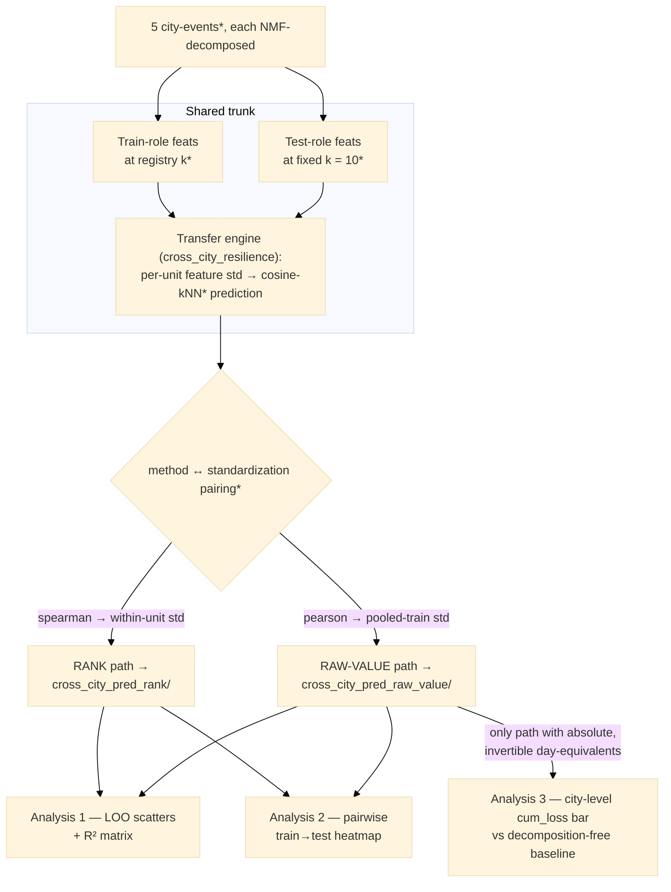

# Technical Note · Cross-City Resilience Prediction

## Overview

Everything under `outputs/nmf/cross_city_resi_pred/` answers one question. Can the disaster resilience of a city-event the model
has never seen be predicted from the other city-events? Four analyses share one trunk, the same per-component feature tables and
the same transfer engine, and differ only in the question each asks and in which of two modes it runs. The RANK path (spearman,
within-unit standardization, `cross_city_pred_rank/`) asks whether the within-city ORDERING of component resilience transfers;
the RAW-VALUE path (pearson, pooled-train standardization, `cross_city_pred_raw_value/`) asks whether the absolute LEVEL does.

Analyses 1 and 2 run on both paths. Analysis 3 exists only on the raw-value path, because reconstructing a city's `cum_loss` in
day-equivalents needs a prediction invertible back to an absolute scale, which ranks cannot supply. Analysis 4, the whole-curve
prediction of §8 (STEP 7 of run_pattern_nmf.py), rides the same trunk on the raw-value path and upgrades the predicted quantity
from the cum_loss scalar to the full disaster-window trajectory. The flowchart covers analyses 1 to 3.

Terms marked `*` in the diagram:

- **5 city-events**: `BR_Ida`, `FM_Ian`, `WM_Dorian`, `WM_Isaias`, `LC_Laura` (run_pattern_nmf.py:249-294). "Unit" below always
  means one city-event.
- **registry k and k = 10**: each unit's own tuned `n_behaviors`, between 9 and 11, against the fixed test-role
  `K_LOO_TEST = 10` (run_pattern_nmf.py:539).
- **cosine-kNN**: the transfer model (`CROSS_CITY_MODEL`, run_pattern_nmf.py:609), a similarity-weighted mean of training
  targets (§3).
- **pairing**: `CROSS_CITY_METHOD_STD` hard-pairs each method to one target standardization and one output folder
  (run_pattern_nmf.py:569-572).

## Step 1 · Shared trunk, two feature tables per city-event

### 1 · Problem

Every analysis needs, per city-event, a table with one row per NMF component holding predictors and resilience targets. One unit
plays two roles with different requirements, because in the training role its components teach the model, whereas in the test
role they are predicted as if the city were unseen.

### 2 · Approach

The helper `_build_cross_city_feats` produces both tables, the train-role one decomposing the city at its registry k and the
test-role one re-decomposing the same activity matrix at the fixed k = 10, each assembling only the cross-city columns
(run_pattern_nmf.py:996-1059). Rebuilding the train role here rather than reusing the per-city analysis loop's table is
deliberate, because the two roles decompose the same matrix at different k. Both use the pipeline's single global-IWF functional
recipe (§2), which since 2026-07-12 also labels the within-city analyses; the per-city loop's table survives but feeds only the
within-city LOO comparison and the intensity-versus-resilience scatter (run_pattern_nmf.py:2246-2259).

Both tables carry `weight_normal`, the component's share of the city's normal-period baseline activity, computed as the sum of
its temporal factor over the normal slots times the sum of its spatial factor over OD pairs, which is the aggregation weight
analysis 3 needs, plus the two per-event-constant LEVEL covariates `hurricane_intensity` and `evac_level`
(run_pattern_nmf.py:1048-1053). The predictors are the six merged functional shares
`func_<cat> = share_from_<cat> + share_to_<cat>`, `mean_distance`, and `median_income_combined`, the last being the component's
loading-weighted median household income from the ACS block-group cache, formed per flow as the nan-aware mean of the origin and
destination block-group incomes and then weighted by the H loadings (run_pattern_nmf.py:1013-1019,
utils/pattern_analysis/component_features.py:288-316). The eight columns are assembled at run_pattern_nmf.py:1020-1031, and the
LEVEL covariates join only in raw-value mode (§2). The target is `cum_loss`, for which higher means worse; drop_depth,
early_collapse, recovery_day and recovery_deficit were retired on 2026-07-12 and remain computed, but unconsumed, in
component_features.resilience_features. The step yields `cc_train` and `cc_test`, both labelled with the one shared global-IWF
category lookup, built once in main() and reused by all three analyses (run_pattern_nmf.py:2246-2259).

### 3 · Interpretation · why is the test role frozen at k = 10?

Each city's registry k was tuned, partly on cross-city objectives, so letting the held-out city keep it would leak model
selection into the evaluation, and a genuinely new city would arrive with no tuned k anyway. One conventional k makes the folds
comparable and deployable, while training units keep their registry k, since tuning is legitimate on the training side. The
constant is module-level so the Optuna tuner mirrors the convention (run_pattern_nmf.py:535-539, tune_nmf_optuna.py:28-30).

### 4 · Interpretation · why does the exact definition of cum_loss matter here?

`cum_loss` is the NET, unclipped cumulative deviation Σ_d (1 − r(d)) over the disaster window, so above-baseline surges cancel
drops. It is therefore linear in r and additive across components, the property analysis 3's reconstruction relies on
(utils/pattern_analysis/component_features.py:417-422, 458).

## Step 2 · Shared trunk, the two standardization paths

### 1 · Problem

A cross-city prediction is meaningful only on a scale both cities share, and "shared scale" can mean either a shared ordering or
a shared absolute level. Every feature, and the target, must be standardized in the frame matching what it can honestly claim
across cities, since mixing frames, for instance by pooling per-unit ranks, would manufacture signal. The single choice of method
pins feature side and target side together into two disjoint paths.

### 2 · Approach

`CROSS_CITY_METHOD_STD` pins each method to one target standardization and one output folder, and the pairing is enforced,
because both `analysis_cross_city` and `analysis_cross_city_pairs` raise `ValueError` on a mismatching explicit `target_std` or
output subfolder before anything is computed (run_pattern_nmf.py:569-572, 1083-1094, 1414-1426). Only spearman with
`within_unit` into `cross_city_pred_rank/`, and pearson with `pooled_train` into `cross_city_pred_raw_value/`, ever run.

One preparation step is shared, and it is the only one. For each metric `_prep` builds one city-event's table, dropping rows with
a missing feature or target, skipping a unit with fewer than 8 usable components or a constant target, and, in rank mode,
rank-transforming every feature column and the target within the unit. It returns the feature matrix before any standardization,
so neither path inherits a standardization from the other (utils/pattern_analysis/ml_resilience.py:209-229).

On the RANK path all eight feature columns are z-scored within their own city-event, and the target likewise, while
`pooled_feature_cols` and `level_feature_cols` stay inert. A rank says only that one component lost more than another in this
city, so only a within-unit frame is honest, and a pooled z-score of per-unit ranks would fake a cross-city level ranks cannot
carry (utils/pattern_analysis/ml_resilience.py:271-274 for the transfer,
utils/pattern_analysis/ml_resilience.py:302-304 for the pooled-LOO diagnostic).

On the RAW path everything carrying a real cross-city level is standardized on the pooled training statistics and the same
transform applied to the test unit, so each city's absolute level survives and analysis 3 gets its invertible scale
(utils/pattern_analysis/ml_resilience.py:271-300). That covers `POOLED_FEATURE_COLS`, which under the production config is every
feature (utils/pattern_analysis/ml_resilience.py:284-289); the target, whose pooled-train mean and standard deviation are
reapplied to the test so the test city's level offset survives in the residual and R² also penalizes a level mismatch
(utils/pattern_analysis/ml_resilience.py:290-293); and the two per-event-constant covariates, which are appended rather than
scaled in place (utils/pattern_analysis/ml_resilience.py:294-300). Under config C nothing stays within-unit, and every
downstream output lands in its method's paired folder.

### 3 · Interpretation · what can each raw-path column claim across cities?

The functional shares are pooled under "config C", the 2026-07-07 flip, which supersedes the earlier design, recorded in prior
versions of this note, where they stayed within-unit because a within-city TF-IWF made each `func_<cat>` non-comparable.
`func_<cat>` is now built with a global TF-IWF, in which the per-block-group land-use score mass is pooled over all city-events'
block groups, one shared rarity-weight vector is computed at the exponent `GLOBAL_IWF_SCALE` of 1.52, and every city's block
groups are labelled with those same weights (`_global_landuse_classification`, run_pattern_nmf.py:629-658; the pooled weights
come from `pooled_iwf_weights`, utils/data_processing/fetch_sld_landuse.py:242-250, applied through the `iwf=` override in
`classify_dominant_function`, utils/data_processing/fetch_sld_landuse.py:305-313). Because a func value now means the same thing
everywhere it joins `mean_distance` in `POOLED_FEATURE_COLS` (run_pattern_nmf.py:601); pooling is coherent only under this
global IWF, since with the per-city IWF it is worse. Since 2026-07-12 this is the only land-use recipe, so the one
classification computed in STEP 1 also labels the within-city functional analyses and the baseline's city-wide POI shares, which
changed the within-city numbers of notes 1 and 2 but, by construction, no cross-city prediction. The global IWF is transductive
(§7).

`mean_distance` is pooled because typical trip length is a raw physical magnitude whose cross-city level is real signal.
`median_income_combined` is pooled as the 2026-07-08 addition, because a loading-weighted median household income is a USD
magnitude comparable across cities. Its useful signal, however, is not the cities' mean income, which is nearly identical across
these five events and shared exactly by the two same-city events; it is the within-city spread across components, that is, which
income levels' mobility patterns lose more, which only the decomposition exposes. Adding it cut the component-wise (M1) city MAE
from 0.953 to 0.499, after which `evac_level` took it to 0.270, while the static-income-augmented baseline barely moved, from
1.286 to 1.246, the control showing that the gain needs the decomposition (run_pattern_nmf.py:1013-1019, 601). Folding func into
the pooled group unlocked the cross-city severity signal of §6, because it is the first setup that separates the two Wilmington
events, which share an identical city-wide composition yet decompose differently.

### 4 · Interpretation · why are the two LEVEL covariates handled separately?

A per-event-constant column would be zeroed by within-unit standardization, so each is standardized on the pooled train and
appended instead. `hurricane_intensity`, the Saffir-Simpson arrival category, lets the model tell a Cat 1 from a Cat 4 event.
`evac_level`, the 2026-07-08 addition, is the block-group-population-weighted mean of the HEvOD three-level ordinal evacuation
strength, 0 none, 1 voluntary, 2 mandatory, per city-event, from data/evacuation_orders/. It is comparable across cities because
the HEvOD Order Type is a standardized ordinal, and it varies across same-city events, 0.81 for WM_Dorian against 0.02 for
WM_Isaias, where the static POI and city-income covariates are identical. Adding it cut the M1 city MAE from 0.499 to 0.270 (§6).

Both covariates feed the COMPONENT-level path only, meaning M1, kNN(σ), and the LOO-R² and pairwise analyses sharing
`LEVEL_FEATURE_COLS`. The city-level cosine-kNN reconstruction and the decomposition-free baseline deliberately do not take
`evac_level`, because over their low-dimensional standardized city vector it is collinear with `hurricane_intensity` and
reshuffled the n = 5 nearest neighbours unhelpfully; a sandbox A/B worsened both, city-kNN from 0.802 to 1.07 and the baseline
from 1.246 to 1.42 (run_pattern_nmf.py:573-588).

## Step 3 · Shared trunk, the transfer engine

### 1 · Problem

With features and target standardized (§2), all three analyses need one estimator mapping a component's standardized features to
its standardized target, differing only in how units are split and how the prediction is scored.

### 2 · Approach

That estimator lives inside `cross_city_resilience` (utils/pattern_analysis/ml_resilience.py:147-388). A test component's
prediction is the cosine-similarity-weighted mean of the training components' targets, ŷ(x) = Σ_i s_i·y_i / Σ_i s_i with
s_i = max(cos(x, x_i), 0) over the standardized feature vectors, and all-non-positive similarities fall back to the training mean
(utils/pattern_analysis/ml_resilience.py:243-252). Quality is the R² between standardized true and predicted test targets.
Disjoint train and test lists give a TRANSFER, pooling the training units and predicting each test unit, whereas identical lists
give a POOLED leave-one-component-out, which with a single unit is that unit's within-city LOO and supplies analysis 2's diagonal
(utils/pattern_analysis/ml_resilience.py:339-388).

### 3 · Interpretation · why a local weighted mean rather than a global linear fit?

The Nadaraya-Watson form is a convex combination bounded to the training-target range. With roughly 40 pooled training rows a
global linear fit, kept as the alternative `model='ridge'`, can extrapolate wildly on an unseen city, whereas the local weighted
mean degrades gracefully.

## Step 4 · Analysis 1, leave-one-city-event-out prediction

### 1 · Problem

With all other city-events pooled as training data, how well are an unseen city's per-component resilience metrics predicted, for
every choice of held-out city?

### 2 · Approach

main() loops over the five units, each fold taking the held-out unit's k = 10 test-role table against the rest's registry-k
train-role tables, and `analysis_cross_city` runs the engine on that fold once per method, into its paired folder
(run_pattern_nmf.py:2265-2281, 1062-1203). Per fold it writes a predicted-versus-actual scatter,
`cross_city_scatter_<CODE>_baseline.png`, plus its point-level raw CSV under `raw_data/`; the `baseline` suffix is the
context-aware-NMF tag, context-aware being off, and is not the analysis-3 baseline. After the five folds main() assembles each
held-out unit's R² into the one-metric by five-unit matrix `raw_data/loo_cross_city_r2_baseline.csv`
(run_pattern_nmf.py:2284-2290).

### 3 · Interpretation · how should a scatter be read?

Each scatter (`vis_scatter_reg_pred`, one cum_loss panel with a dashed y = x line and the test R² in the title;
utils/pattern_analysis/visualization.py:1068) shows the held-out city's components on the standardized scale, labelled "std rank"
on the rank path and "std value" on the raw path. An R² above 0 means the transfer beats predicting the training mean. In the
raw-value version a systematic level miss alone drives R² negative even when the ordering is right, which is exactly the
difference the two folders expose.

## Step 5 · Analysis 2, the pairwise transfer heatmap

### 1 · Problem

Analysis 1 pools the training cities, which hides which cities carry the signal. Does city a alone predict city b, is transfer
symmetric, and does any single-city transfer beat the city's own within-city fit?

### 2 · Approach

`analysis_cross_city_pairs` runs the engine for every ordered pair, training on a at its registry k and testing on b at k = 10,
keeping only the `cum_loss` R², the metric the project's tuning and the city-level reconstruction center on. The diagonal, where
a equals b, is a's within-unit leave-one-component-out at k = 10, the reference for how predictable that city is from itself
along its own row and column (run_pattern_nmf.py:1402-1471). The product is a 5 by 5 matrix, rows train and columns test, saved
as `cross_city_pair_heatmap.png` with `raw_data/cross_city_pair_heatmap.csv` in each method's folder, rendered by
`vis_heatmap_pair_transfer` on a diverging color scale centered at 0 with every cell
annotated. **Updated 2026-08-04**: the cells now carry the pair's Spearman rho, not R²
(this channel predicts an ordering, and R², being unbounded below, let a few catastrophic
pairs dominate); the diagonal is excluded, and the matrix is reordered into Louvain
communities that are boxed. Comparing an off-diagonal cell to its row's diagonal shows how much is lost going
cross-city, and comparing the two method folders shows whether a pair shares ordering, level, both, or neither.

## Step 6 · Analysis 3, city-level cum_loss against the decomposition-free baseline

### 1 · Problem

The end goal is a city-level number, the day-equivalents of mobility lost. Does routing the prediction through the NMF
decomposition, predicting each component and then aggregating, beat a baseline that never decomposes anything? This analysis runs
only on the raw-value path, because the reconstruction must invert standardized predictions back to absolute day-equivalents and
within-unit-standardized ranks cannot support that, so `analysis_cross_city_resi_pred` returns immediately unless method is
pearson and target_std is pooled_train (run_pattern_nmf.py:1235-1238).

### 2 · Approach

For each held-out city the same pearson and pooled-train transfer as analysis 1, now on config-C features, gives standardized
`cum_loss` predictions for the city's k = 10 components. The open question is only how to turn those into one city-level
day-equivalent, and this step answers it three ways from the same predictions, all inside one fold helper (`_fold`,
run_pattern_nmf.py:1306-1327).

Reconstruction 1, kNN (σ), un-standardizes each component prediction with the fold's mean and standard deviation, then averages
with `weight_normal` weights. The engine does not return the fold's pooled-train scale, but because the test components' true
`cum_loss` is available both raw and standardized and the two are related by an exact linear map,
sigma = sd(raw)/sd(standardized) and mu = mean(raw) − sigma·mean(standardized) recover it without touching the engine's API. It
reaches MAE 0.789 with correlation 0.998, lifted from 1.171 once the evac covariate sharpened the component predictions, BR_Ida
having flipped from a negative prediction to a positive one (run_pattern_nmf.py:1318-1324, 1329-1332).

Reconstruction 2, M1, keeps the components standardized and calibrates once at city scale. The standardized component
predictions are `weight_normal`-aggregated into one city score s_city, mapped to day-equivalents by a one-parameter city-scale
VARIANCE MATCH, pred = mean(GT_train) + (s_city − mean(s_train)) × std(GT_train)/std(s_train). The scale is learned NESTED-LOO on
the other training cities only, each scored by a model trained on the remaining training cities, so the held-out test city never
enters the calibration and nothing leaks. It reaches MAE 0.270 with correlation 0.993, the best on both calibration and ranking
by a clear margin. Two predictor additions drove the jumps, income first cutting it from 0.953 to 0.499
(`median_income_combined`, 2026-07-08) and `evac_level` then from 0.499 to 0.270, the largest single-city gain being WM_Isaias,
whose predicted cum_loss moved from 4.67 to 3.70 against a ground truth of 3.80 (run_pattern_nmf.py:1324-1326, 1347-1359).

Reconstruction 3, city-kNN, runs a city-level cosine-kNN over the `weight_normal`-aggregated feature vector, holding config-C
func, distance, income and intensity but not `evac_level` (§2), and predicts ground truth directly. Being a cosine-weighted
average of the training cities' ground truths it is a convex combination bounded to their range, so there is no per-component
sigma to mis-scale at all. It reaches MAE 0.802 with correlation 0.513, unchanged by the evac addition it does not take
(`_city_vec`, run_pattern_nmf.py:1296-1300; the reconstruction block at run_pattern_nmf.py:1362-1369).

The city's true `cum_loss` comes from its TOTAL activity curve, all OD flow summed into one series and fed through the same
resilience-feature routine as a single "component", so the target is entirely independent of the NMF
(run_pattern_nmf.py:1260-1265). The decomposition-free baseline predicts each held-out city's `cum_loss` as a
cosine-similarity-weighted average of the other cities' ground truths, with similarity computed on an eight-dimensional city
vector holding the Saffir-Simpson arrival intensity, six city-wide TF-IWF POI-type shares, and the static city-wide mean of the
block-group median household incomes, z-scored per feature so intensity does not dominate the cosine; negative similarities are
clipped and an all-non-positive case falls back to the uniform mean (run_pattern_nmf.py:1248-1283, 1372-1375). The city-wide
shares apply the pipeline's global TF-IWF weights to the city's summed SLD quantities (`_city_poi_share`,
run_pattern_nmf.py:1188-1202), so the baseline uses the same single recipe as everything else since 2026-07-12, which moved its
MAE from 1.246 to 1.288.

The verified city-level cum_loss figures, as MAE and correlation with ground truth over the five-city LOO in day-equivalents,
dated 2026-07-12 with income and evac level under the unified global recipe, are M1 0.270 and +0.993, kNN(σ) 0.789 and +0.998,
city-kNN 0.802 and +0.513, baseline 1.288 and −0.120, and constant-mean 1.187. The output is a grouped bar per city-event
showing all five, y in day-equivalents and each predictor's MAE annotated.

> **Superseded 2026-08-04.** The M1 (pre-r0 aggregate-then-denormalize) and city-kNN
> reconstructions were removed, so `cum_loss_pred_m1` and `cum_loss_pred_city` no longer
> exist. `raw_data/cross_city_resi_pred.csv` now holds `cum_loss_gt`, `cum_loss_pred_knn`
> (legacy kNN(σ), CSV-only), `cum_loss_baseline`, and
> `cum_loss_pred_aggr_denorm_<model>` for each of cosine-kNN and ridge — the surviving
> `aggr_denorm` strategy, which adds the day-0 anchor r0 to the pooled features. The
> figure is no longer a grouped bar: `bar_cross_city_resi_pred.png`/`.svg` is a two-panel
> figure (a: observed bars with predictions as markers on error stems, cities sorted by
> observed loss; b: leave-one-out R² per method with MAE). Both live under
> `cross_city_resi_pred/city_total/`, with a per-predictor calibration scatter in
> `decomp_pred_aggr_denorm/<model>/`. The five-city numbers quoted above are provenance
> for the retired methods, not current results; at 13 city-events the surviving figures
> are LOO R² −0.46 (cosine-kNN) and +0.17 (ridge) against a baseline at −0.55.
> NOTE this note still describes the five-city era throughout and needs a full pass.

> **Upgraded 2026-08-14 — the city (ρ) stage is now a regression, not a scalar match.**
> The estimator is explicitly two-stage. Stage φ is unchanged: the component ridge on
> `CITY_TOTAL_FEATURE_COLS` predicts each component's standardized `cum_loss`, and the
> `weight_normal` aggregate of those predictions is the city score s. Stage ρ used to be
> the bare scalar variance match above (pred = mean(GT) + (s − mean(s))·σ_GT/σ_s). It is
> now a ridge of city `cum_loss` on **[s, r0_city, GDP]** for DIRECTION, whose fit is then
> variance-matched (de-shrunk) onto day-equivalents for SCALE — ĉ = mean(GT) + (ẑ − mean(ẑ))·σ_GT/σ_ẑ,
> where ẑ is the ridge fit. The scalar match is the one-predictor special case (its slope
> σ_GT/σ_s is the reduced-major-axis / Model-II slope), so ρ on [s] alone reproduces the
> old number; adding the two city-level terms lifts honest nested-LOO R² from **+0.47 to
> +0.58** (MAE 0.88, jackknife floor +0.50). `r0_city` is the `weight_normal`-mean day-0
> activity (already a φ feature; it re-enters ρ as a city-constant term). **GDP** is the
> metro's 2019 real GDP (BEA CAGDP2, LineCode 1, county-summed), a pre-event normal-period
> static wired from `data/msa_static/msa_features.csv`; it is an exposure/size proxy (small
> metros sit fully inside the storm footprint) and correlates negatively with `cum_loss`,
> not a wealth effect (per-capita GDP is not significant). Both consumers — STEP 6's headline
> and STEP 7's curve-shift target — now call one shared function `_city_total_from_scores`,
> so the ρ math cannot drift between them. Ridge, not OLS, sets the direction: on three
> partly collinear predictors over 12 units OLS is unstable, and OLS-direction + the same
> de-shrink scores +0.54 (it equals the exact multivariate RMA / variance-constrained least
> squares, kept as the clean single-model reference).

### 3 · Interpretation · why is weight_normal the right aggregation weight?

The natural weight is not the NMF importance ‖W‖·‖H‖ but `weight_normal`. Because each relative curve r_i is normalized by its
own normal baseline, the city's total curve is r_total = Σ p_i·r_i with p_i that baseline share, and since `cum_loss` is the
unclipped Σ(1 − r) it is linear in r, giving exactly cum_loss_total = Σ p_i·cum_loss_i (run_pattern_nmf.py:1042-1048).

### 4 · Interpretation · why is kNN (σ) mis-calibrated where M1 is not?

This is the σ-mismatch. Inverse-standardization assumes the prediction's statistics match those of a properly standardized
target, and they do not. The sigma kNN(σ) applies is the pooled-train per-component cum_loss spread, about 6, because net
per-component cum_loss swings by roughly ±10 with sign flips, whereas the kNN output is a shrunk convex combination rather than a
standardized value, so multiplying by 6 over-amplifies it. M1 sidesteps this by calibrating with the small city-level cum_loss
dispersion, about 1.4, while keeping the prediction itself at component level. City-kNN's MAE of 0.802, meanwhile, rides partly
on the bounded kNN staying central rather than on genuinely ordering the cities, which its correlation of 0.513 exposes; it sits
third, behind M1 and kNN(σ).

### 5 · Interpretation · what makes the baseline an honest null?

Its income entry keeps it decomposition-free, a static census summary with no flow weighting, which makes it the fair
income-augmented control. When income was added on 2026-07-08, then still under the per-city city-share recipe, it barely moved
the baseline, from 1.286 to 1.246, because the static city incomes are nearly identical across these events and two same-city
events share the value exactly. That contrast shows the decomposition methods' income gain to come from the flow-weighted
within-city component spread rather than from income as a city covariate. The baseline says only that similar cities suffer
similarly, using nothing that requires a decomposition, and the component pipeline earns its keep only by beating it.

## Section 7 · Caveats for analyses 1 to 3

- **Five folds only, and M1's calibration rests on just four.** Every headline number rests on five city-events, two of them the
  same city, Wilmington, so a single odd event moves the picture. M1 is the most exposed, because its variance-match scale is a
  ratio of two standard deviations each estimated from only the four training cities and driven by an outlier, `FM_Ian` being
  the high one. Read M1's 0.270 as a promising mechanism rather than a trustworthy number (run_pattern_nmf.py:1347-1359).
- **`evac_level` sharpens the component methods but is fragile too.** It cut M1 from 0.499 to 0.270 and kNN(σ) from 1.171 to
  0.789, yet in a sandbox A/B it worsened the city-level cosine-kNN reconstruction, from 0.802 to 1.07, and the baseline, from
  1.246 to 1.42, so it is confined to the component path (§2), and its gain rests on the same five folds.
- **The global IWF is transductive, and since 2026-07-12 it is the only recipe.** Config C pools land-use over all city-events
  including the held-out one, using land-use features only and never resilience labels, so no target leaks, but the rarity
  weights are not strictly held out, and a per-fold train-only IWF would be a stricter future refinement
  (run_pattern_nmf.py:629-658). Because the within-city analyses now use the same pooled weights, adding a city-event shifts the
  existing units' labels slightly.
- **No component correspondence.** Cities are decomposed independently, so transfer works only through the marginal relationship
  from features to resilience, never by matching components.
- **weight_normal exactness is approximate in practice.** The identity cum_loss_total = Σ p_i·cum_loss_i is exact for a single
  shared baseline; with separate weekday and weekend baselines and with NMF reconstruction error it holds only approximately.
- **The baseline's feature z-scoring spans all city-events**, the held-out one included, harmless for a similarity baseline but
  not a strictly held-out scaling (run_pattern_nmf.py:1278-1283).

## Step 8 · Analysis 4, whole-curve prediction (`cross_city_curve_pred`)

### 1 · Problem

Analyses 1 to 3 predict a scalar per component or per city. Analysis 4 asks whether the entire disaster-window mobility
trajectory of an unseen city-event can be predicted day by day. It is implemented as STEP 7 of run_pattern_nmf.py's main()
(`analysis_cross_city_curve_pred`, run_pattern_nmf.py:1495), and "STEP 7" below always names this code stage. The prediction
window equals the cum_loss window, d = 0..14.

### 2 · Approach

The problem setting is borrowed from Li, Wang and Chen (KDD 2024). Their formulation is spatiotemporal, covering many spatial
units jointly; this pipeline applies its single-unit reduction to every NMF component of the held-out unit and keeps the input
convention unchanged, so the observed initial post-disaster state and the normal baseline are legitimate inputs while the
recovery process itself is the target (run_pattern_nmf.py:99-101, utils/pattern_analysis/component_features.py:475-484).

Four method lines recur through §8 and §9, all constructed in §8.7. The component-wise forecast ('pred') is the production
design, built in §8.4 to §8.6. The TRAIN-MEAN line is its zero-shrinkage special case, the same per-component synthesis with the
pooled-train mean rate and the plateau pinned at 1, taking no cum_loss correction. The CITY-WISE line is the decomposition-free
reference, one predicted rate and one logistic for the whole city. The ORACLE is each component's own ungated fit of the full
family, the descriptive ceiling. The two reference comparisons answer different questions, so §8.7 reads 'pred' against the
city-wise line while §10 reads it against the train-mean line. Sub-steps §8.1 to §8.7 follow the code's execution order; §9 then
records every forecasting method tried on the way here, and §10 the caveats.

### 3 · Interpretation · what may the forecast read, and what may it never read?

For each held-out unit the forecast may read the other four units' feature tables and resilience values, the held-out unit's
component FEATURES, and the held-out unit's observed day-0 value per component, day 0 being the landfall day and written r0
below. It may never read the held-out unit's smoothed curve beyond day 0, nor any of its resilience targets. These rules are the
INPUT CONTRACT, referred to by that name below and in §10.

The features do not smuggle post-day-0 behaviour in through the decomposition, because every decomposition in the pipeline, the
k = 10 test role included, fits its spatial basis H on the pre-disaster columns, normal plus buffer, and merely projects the
disaster window onto that frozen basis (`fit_segments`, run_pattern_nmf.py:236, 2117-2121;
utils/pattern_analysis/nmf_pipeline.py:137-142), and the func shares, mean_distance and income loadings are all computed from
that pre-disaster H (run_pattern_nmf.py:1006-1031). The one genuine qualification is that the curve smoother folds the observed
raw day-1 value into the day-0 anchor, which §10 records as a caveat.

### Step 8.1 · The curve model, one family and two tiers

#### 1 · Problem

Observed component curves are not all monotone recoveries, since a majority settle away from the baseline and many show
mid-window humps, meaning activity far above baseline, or late-deepening dips. A family that cannot express these shapes
contaminates every parameter fitted through it.

#### 2 · Approach

The family adopted for FITTING is the surge-plus-relaxation model

    r(t) = L / (1 + (L/r0 − 1) e^(−α t)) + B t e^(−b t),

a free-plateau logistic anchored exactly at the observed day-0 value r0, plus a signed forced pulse. The plateau L absorbs
settle-away-from-baseline endings and the pulse (B, b) absorbs the transient hump or dip, so the jointly fitted α is a
decontaminated, or "clean", recovery rate. The fit is a multi-start nonlinear least squares with five starting points and bounded
parameters (utils/pattern_analysis/component_features.py:464-556). A component whose joint fit explains less variance than a
constant is gated to NaN (utils/pattern_analysis/component_features.py:563), and the gate applies wherever the family is fitted,
so the train-role and test-role tables both go through the same gated call (run_pattern_nmf.py:1025-1030) and only the oracle fit
of §8.2 disables it. The FORECAST uses only the monotone logistic slice, with the pulse removed by setting B = 0. The fit knobs
live at run_pattern_nmf.py:378-387 and the single forecast knob, the shrinkage weight CURVE_PRED_SHRINK = 0.5, at
run_pattern_nmf.py:389.

#### 3 · Interpretation · why fit a richer family than the forecast uses?

Every attempt to predict the shape parameters α, L, B and b across cities failed, as §9 records, so the forecast keeps the family
but lets exactly one predictable quantity into it. Fitting the full family remains necessary, because only the free plateau and
the pulse make the fitted α clean enough to average.

#### 4 · Interpretation · on which side of the transfer does the quality gate bind?

On the training side only. A gated training component supplies no rate row and would otherwise teach the transfer noise, whereas
a gated test component still receives a forecast, since the forecast needs no fitted parameters from the test side. A gated
test-side NaN therefore surfaces only in the raw parameter CSV, in the alpha_fit column
(run_pattern_nmf.py:1907, 1983-1985, 2013).

### Step 8.2 · Observed inputs assembled per unit

#### 1 · Problem

Before any prediction, the function must assemble, for every unit, the observed objects later steps consume
(run_pattern_nmf.py:1598-1618).

#### 2 · Approach

The first object is the set of smoothed relative curves of the unit's TEST components at k = 10, whose day-0 row supplies the r0
anchors (run_pattern_nmf.py:1605). The second is the UNGATED own fit of the full four-parameter family, kept for the oracle line
and echoed per component into the raw parameter CSV alongside the gated values (run_pattern_nmf.py:1609-1613, 2021-2026); it is
ungated because the oracle should show what the family can express rather than what survives the §8.1 gate. The third is the
observed TOTAL city curve, the ground truth every method line is scored against (run_pattern_nmf.py:1615). The fourth is the
day-type-matched baseline of the total activity matrix, converting relative curves into absolute daily flow volume for the
magnitude figures (run_pattern_nmf.py:1617, daily_baselines at utils/pattern_analysis/component_features.py:571). Train-role and
test-role tables arrive from the shared trunk (§1) carrying each functional category's from-share and to-share separately, and
STEP 7 merges each pair into one `func_<cat>` column for itself (run_pattern_nmf.py:1588-1595), which is why §1 lists the
predictors already merged.

### Step 8.3 · The transfer helpers, one engine in two frames

#### 1 · Problem

The forecast needs an absolute level and a within-city ordering, and one estimator has to supply both without mixing their frames.

#### 2 · Approach

Both component-level helpers go through the same engine as analyses 1 to 3 (§3), in two disjoint frames mirroring the note's two
standardization paths; they are named the RAW CHANNEL and the RANK CHANNEL throughout §8 to §10. The only construction here that
bypasses the engine is the city-wise line, detailed in §8.7 (run_pattern_nmf.py:1646-1671).

The raw channel, `_param_prediction` (run_pattern_nmf.py:1673), predicts a target in absolute units by standardizing features
and target on pooled-train statistics, appending the LEVEL covariates, running the cosine-kNN, and un-standardizing with the same
pooled-train mean and standard deviation, so no held-out information enters the scale. The engine's joint dropna over target and
features forces two accommodations. Because the test unit has no real target, the helper writes a finite increasing placeholder
into the test table's target column, which must be non-constant so that `_prep` does not skip the unit (§2) and which is never
read, since transfer mode consumes train rows and test features only (run_pattern_nmf.py:1694-1698); and because the dropna also
drops feature-incomplete
TEST components from the output, the helper initializes its returned vector at the pooled-train mean so those components fall
back to it (run_pattern_nmf.py:1708-1713). It also returns that mean, which §8.4 uses directly.

The rank channel, `_rank_score_prediction` (run_pattern_nmf.py:1716), predicts a within-city ORDERING. Here every feature and the
target are rank-transformed within their own unit before standardization (utils/pattern_analysis/ml_resilience.py:222-224),
which erases each city's absolute level and scale. Its feature list is the eight trunk predictors plus the observed r0 as a
ninth, likewise rank-transformed, column (run_pattern_nmf.py:1731), and the caller uses only the order of the returned scores.

#### 3 · Interpretation · why is r0 admitted as a predictor, and why keep a separate rank channel?

The day-0 drop is mechanically the strongest single correlate of cum_loss and is already a legitimate input under the §8 contract
as the curve anchor, so both channels receive it, the raw channel as an extra pooled predictor (run_pattern_nmf.py:1904) and the
rank channel as a rank feature (run_pattern_nmf.py:1033-1039). The rank frame is kept because it is immune by construction to the
cross-city level and scale drift the pooled frame must assume away; its advantage over the raw channel's ordering is real but
modest, and the §9.10 ablation quantifies it.

### Step 8.4 · The backbone rate, a pooled mean rather than a prediction

#### 1 · Problem

The backbone is the forecast's base object, the family logistic at one rate with the plateau pinned at 1 and anchored at each
component's own r0. Every forecast curve is a correction of the backbone, so the per-unit loop's first decision is what the
backbone's rate should be.

#### 2 · Approach

The answer is the pooled-train MEAN of the gated clean rate, stored as recovery_alpha, taken from the raw channel's second return
value and written ᾱ below (run_pattern_nmf.py:1896). It averages only training rows whose fit produced a finite rate and whose
features are complete, since the helper drops rows through a joint dropna over the target, the features and the level covariates
(run_pattern_nmf.py:1681-1692). A rate is finite only after six conditions clear in sequence, the fit returning NaN on an all-NaN
curve, on an r0 that is not finite or lies at or below 1e-6, on fewer than 5 finite days, on a near-constant curve, on fit
failure, and last of all on rejection by the quality gate of §8.1
(utils/pattern_analysis/component_features.py:503-512, 527-536, 559-563). The helper draws only on training units keeping at
least CROSS_CITY_MIN_ROWS = 5 such rows with a non-constant target. The raw channel still computes a per-component rate
prediction as a side product, but the caller consumes only the pooled-train mean and, through the channel's empty return, the
unit-skip signal (run_pattern_nmf.py:1896-1899); a unit is skipped entirely when no training unit clears the row threshold
(run_pattern_nmf.py:1897-1899).

#### 3 · Interpretation · why is the rate not predicted per component?

Because the features carry no rate signal at all. In the per-unit leave-one-component-out ridge diagnostic
(`fit_resilience_linear`, utils/pattern_analysis/ml_resilience.py:44-108) the fitted rate's R² is negative in all five units,
whereas the cum_loss R² reaches 0.70 in the best unit, and the asymmetry is restated where the forecast consumes it
(run_pattern_nmf.py:1504-1508). Using the mean is therefore not a simplification but the best of every alternative tried (§9).

#### 4 · Interpretation · why was the row threshold lowered to 5?

It was lowered from the engine default of 8 because the NaN rules leave no unit with 8 usable rate rows, the code recording that
the rate is NaN for every component whose curve starts at the baseline or never left it, cases tripping the near-constant
threshold or the quality gate because such a curve offers the family no drop-and-recovery signal to explain. Under the default
every fold's rate transfer would return nothing and the whole forecast would be skipped (run_pattern_nmf.py:617-624, 1706, 1733).

### Step 8.5 · The component cum_loss prediction, quantile mapping from two channels and an observable spread

#### 1 · Problem

The one quantity with real cross-city feature signal is cum_loss, so the forecast must route all its city-specific information
through a predicted per-component cum_loss vector, written ĉ below.

#### 2 · Approach

ĉ is assembled by quantile mapping, the comonotone assignment in which the predicted ordering is kept and the values are read off
a reference distribution; this is optimal transport in the elementary one-dimensional sense that sorting one sample onto another
minimizes every convex coordinatewise transport cost on the line. Four ingredients each contribute what they transfer best
(run_pattern_nmf.py:1900-1926).

- **Total.** The raw channel predicts each component's cum_loss from the pooled predictors plus the observed r0 (§8.3;
  run_pattern_nmf.py:1904). In the main case only the weight_normal aggregate is consumed, because the aggregate is the strongest
  transferable quantity while the individual raw values are over-compressed.
- **Ordering.** The rank channel orders the held-out unit's components by predicted within-city cum_loss rank
  (run_pattern_nmf.py:1905).
- **Shape.** The pooled-train cum_loss values form an empirical reference distribution, and the component ranked j of n receives
  its (j − 0.5)/n quantile (run_pattern_nmf.py:1754-1810).
- **Spread.** Those quantiles are then multiplied by a city-specific scale, the ratio of the held-out unit's backbone-loss
  dispersion to the mean backbone-loss dispersion of the training units. The dispersion of a unit is the standard deviation, over
  its components, of the loss its L = 1 backbone alone would accumulate, so it is computed from observed anchors and the pooled
  rate only and is therefore available for the held-out unit as well (run_pattern_nmf.py:1741-1752, 1798-1803).

An additive shift then pins the weight_normal aggregate of the assigned values to the raw channel's predicted city total, so the
strongest channel survives the reassembly exactly, and because that shift re-centers the whole vector, any centering choice made
during assignment or scaling is irrelevant.

#### 3 · Interpretation · why replace the kNN values' own spread?

A kernel smoother predicts each point as a weighted mean of training targets, so it cannot extrapolate and compresses its outputs
toward the pooled mean. Measured on the five folds, swapping the compressed spread for the pooled quantile spread halves the
Wasserstein-1 distance between predicted and true within-city cum_loss distributions, from 4.61 to 2.03, both in raw
per-component cum_loss day-equivalents, the scale §6 notes swings by about ±10
(docs/superpowers/specs/2026-07-14-plateau-inversion-forecast-design.md).

#### 4 · Interpretation · why scale the spread by city, and why is no parameter fitted?

A single pooled reference distribution hands every unit the same dispersion, yet the true within-city dispersion of cum_loss
varies almost twofold across the five units, so the pooled shape over-disperses the homogeneous cities and under-disperses the
heterogeneous ones. The backbone-loss dispersion is used as its stand-in because it ranks the five units almost identically to the
truth, with a rank correlation of 0.90, whereas the dispersion of the raw anchors alone does not, at −0.30; the backbone transform
is what turns an anchor spread into a loss spread. Only the RATIO of the held-out unit's proxy to the training mean proxy enters
the computation, so the unknown constant relating proxy dispersion to true dispersion cancels and nothing has to be fitted. The
applied scales range from 0.46 for WM_Dorian to 2.04 for FM_Ian, and adopting them moved the forecast from 0.0765 to 0.0727,
improving every one of the five units, which no earlier design had achieved
(docs/superpowers/specs/2026-07-14-plateau-inversion-forecast-design.md).

#### 5 · Interpretation · what happens when an ingredient is missing?

Fallbacks here keep ĉ finite and are distinct from the curve-synthesis fallbacks of §8.7. The quantile assignment runs only when
the pooled-train cum_loss pool is non-empty and at least two components have both a finite rank score and a valid anchor;
otherwise, and likewise when the rank channel returns no prediction at all, the whole vector keeps the raw channel's values
exactly, which is the previous production behaviour (run_pattern_nmf.py:1800). When it does run, a component without a usable
anchor or rank score keeps the raw channel's value only up to the common location shift, so its spacing relative to its
neighbours is the raw channel's while its level moves with the vector. The quantile positions are computed over n equal to the
number of usable components rather than the unit's full component count, and the shift is applied only when the assembled vector
is entirely finite (run_pattern_nmf.py:1794-1809).

### Step 8.6 · The plateau inversion, one solved parameter per component

#### 1 · Problem

Each component's entry of ĉ must become a whole curve without any shape parameter being predicted.

#### 2 · Approach

The solution stays inside the fitted family. The forecast curve is the family logistic at the pooled-mean rate ᾱ, anchored at the
component's own r0, with B = 0, and with the plateau L as the single unknown (run_pattern_nmf.py:1836-1890). L is solved so the
curve's net signed loss lands at the shrunk target

    Σ_d (1 − r(d)) = c_base + CURVE_PRED_SHRINK · (ĉ − c_base),

where c_base is the loss the L = 1 backbone already produces. The loss is monotone decreasing in L, so a scalar root-find (brentq
over LEVEL_BOUNDS = (0.05, 5.0), in units of the normal baseline) solves it, and a target outside the reachable range lands on the
bound (run_pattern_nmf.py:384, 1880-1886). Because the shrinkage pulls every synthesized curve halfway back toward the backbone,
the final curves' city aggregate lands about halfway between the backbone's own loss and the raw channel's predicted city total.

#### 3 · Interpretation · why invert the plateau rather than the rate?

Write c(L) for the net loss the synthesized curve realizes as a function of its plateau, the quantity the constraint pins; c(L)
is a different object from ĉ, the predicted target fed into the constraint. Lowering the plateau by some amount adds roughly that
amount of loss on each day after the recovery has run its course. Exactly, at L = 1 the slope is dc/dL = −Σ_d (1 − e^(−ᾱd))·r(d)²,
the window sum of the §9.9 kernel, and because that kernel is near zero only over the first few days and near one thereafter at
the pooled-mean rate, |dc/dL| is about 10 over the 15-day window, therefore |dL/dc| is about 0.1 and prediction error is
attenuated by an order of magnitude on the way into the curve. The loss depends on α inversely instead, since the integrated loss
of the monotone slice scales like 1/α, because a curve recovering twice as fast loses half as much, so inverting gives α ∝ 1/ĉ
and the inverse map amplifies error like |dα/dĉ| ∝ 1/ĉ², which is what killed the direct α-inversion (§9.7).

#### 4 · Interpretation · is this the failed free-plateau transfer of §9.1 again, and what does the solved L mean?

It is not the same thing, because there the kNN predicted L directly from features, and L does not transfer that way, whereas
here L is solved from an integral constraint fed by cum_loss, the one quantity that does. The solved L is accordingly a
loss-matching device and nothing more, its pooled rank correlation with the independently fitted per-component plateau being only
about 0.16, so neither the note nor the code reads it as an estimate of the component's true settling level
(run_pattern_nmf.py:1857-1861). The shrinkage weight 0.5 is likewise a fixed convention, halfway between ignoring the prediction
and trusting it fully, fixed rather than tuned because per-fold tuning of such weights demonstrably overfits at four inner folds
(§9.8).

### Step 8.7 · Method lines, aggregation, scoring and outputs

#### 1 · Problem

The per-unit loop must synthesize the four method lines named in the §8 intro, aggregate them to city level, score them and write
them out (run_pattern_nmf.py:1925-1947).

#### 2 · Approach

'pred' is the plateau inversion of §8.6. The oracle is the component's own ungated four-parameter fit
(run_pattern_nmf.py:1931-1935). The train-mean line is the L = 1, mean-rate backbone, exactly the zero-shrinkage special case of
'pred', so the pair isolates what the cum_loss transfer adds (run_pattern_nmf.py:1896).

The city-wise line predicts one rate for the whole city with a cosine-kNN and draws a single L = 1 logistic anchored at the
observed city day-0 value (run_pattern_nmf.py:1646-1671). Bypassing the engine (§8.3), its inline kNN guards on having at least
two finite training city rates instead of the row threshold of §8.4, standardizes on the training city vectors only, and z-scores
hurricane_intensity jointly inside the city vector instead of appending it as a separately standardized LEVEL covariate the way
the engine does (run_pattern_nmf.py:1653-1660; utils/pattern_analysis/ml_resilience.py:294-300). Its city vector is the
weight_normal-aggregated eight trunk predictors with hurricane_intensity appended and evac_level excluded, mirroring the §6
city-kNN's `_city_vec` (run_pattern_nmf.py:1628-1632), and its training targets are each training city's
weight_normal-weighted mean of its finite fitted component rates, from the registry-k train-role table
(run_pattern_nmf.py:1636-1643). The line silently drops out of a unit's figure and metrics when fewer than two training cities
have a finite city rate, or when the held-out city's day-0 anchor is invalid (run_pattern_nmf.py:1653-1656).

Component curves become the city curve through the weight_normal shares, the exact reconstruction weights of the total relative
curve (§1; run_pattern_nmf.py:1939-1947), and the day-type baseline scales the result to absolute volume where the raw per-day
curves and the magnitude figure are written (run_pattern_nmf.py:1996-2002, 2033-2040). Scoring happens at component and city
level, with MAE, NRMSE (the RMSE divided by the standard deviation of the observed truth at that level) and, at city level only,
R², plus the curve-derived cum_loss so the curve and scalar analyses stay comparable (run_pattern_nmf.py:1949-1979). Written out
are a magnitude figure and a component-grid figure per unit (run_pattern_nmf.py:2027-2040), an accuracy bar chart carrying, for
each city-event, the city-curve MAE of every method line side by side, so the methods are compared on the very quantity the
forecast optimises rather than on any single fitted parameter (run_pattern_nmf.py:2061-2073), the metrics CSV, and three raw CSVs
holding the per-day city curves, the per-component parameter table (with the consumed ĉ, the raw-channel ĉ, the rank score, the
applied spread scale and the solved L), and the plotted MAE table itself (run_pattern_nmf.py:2050-2066).

An earlier version of this step drew a city-level α bar chart instead, comparing the fitted city rate against the city-wise
prediction and the train mean. It was removed in favour of the MAE chart because the component path predicts cum_loss rather
than a rate, so it could contribute no bar and the figure silently compared only the two lines that are not production. Nothing
else depended on it, and the fitted rates it displayed remain in the per-component raw table.

Every curve MAE in §8, §9 and §10 is a city-curve MAE of the RELATIVE daily curve, in fractions of the normal baseline, so 0.0727
means the predicted curve is off by about 7.27 percent of normal daily activity on an average day; these are not the
day-equivalent cum_loss MAEs of §6, and each headline number is the five-unit mean of the per-unit values in
curve_pred_metrics.csv. In current production 'pred' scores MAE 0.0727 against 0.0893 for the train-mean line, 0.1385 for the
city-wise line and 0.0785 for the oracle, while city-curve R² is 0.552 for 'pred' against 0.166 for the train-mean line, −0.219
for the city-wise line and 0.738 for the oracle. Per unit, 'pred' scores 0.0790 on BR_Ida, 0.0499 on FM_Ian, 0.0772 on LC_Laura,
0.0541 on WM_Dorian and 0.1034 on WM_Isaias. That 'pred' undercuts the oracle's MAE is not a typo, and the §10 caveat on the
oracle explains it.

#### 3 · Interpretation · how loosely should the city-wise comparison be read?

The city-wise line keeps a predicted rate even though §8.4 shows rate prediction losing to the mean, because it approximates the
design a practitioner WITHOUT the decomposition would naturally build, namely predict the city's recovery rate from city-level
features, one rate and one curve. The approximation is loose on both sides. On the input side its city vector and even its
training rate targets are decomposition-derived, the targets being weight_normal-weighted means of fitted COMPONENT rates rather
than rates fitted to each training city's own total curve, so a practitioner genuinely without the decomposition could not
reproduce its training data. On the design side it differs from 'pred' in more than the decomposition alone, using a predicted
rate instead of the mean rate and taking no cum_loss correction. That 'pred' beats it on every unit is therefore motivating
evidence that the decomposition pays, whereas the direct evidence that the advantage is structural is the isolation test of §9.4.

#### 4 · Interpretation · what do the curve-synthesis fallbacks cost?

Three per-component conventions keep the synthesis total, distinct from the ĉ-assembly fallbacks of §8.5. A component with an
unusable anchor, meaning an all-NaN curve or a day-0 total stop with r0 at or below 1e-6, emits the constant r ≡ 1 curve in every
synthesized line (run_pattern_nmf.py:1823-1825, 1865-1867). That is free in the all-NaN case, since an all-NaN curve marks a
zero-baseline component (utils/pattern_analysis/component_features.py:507) whose weight_normal is near zero, but the total-stop
case carries no such guarantee and does bias the city aggregate toward normal, a bias accepted because the logistic base is
undefined at r0 = 0. A component whose ĉ is non-finite falls back to the pure L = 1 backbone, with level_solved recorded as 1.0
(run_pattern_nmf.py:1869-1872), and an oracle component whose ungated fit is undefined receives the α = 0 curve, which stays at
r0 (run_pattern_nmf.py:1826).

## Section 9 · How the forecast got here, every method tried

This section records every forecasting design tried, with its outcome and the reason it was kept or replaced. All numbers are
five-fold leave-one-unit-out city-curve MAE in the relative-curve units of §8.7 unless stated otherwise, quoted at the precision
their session record kept, and each is labelled sandbox or production because a sandbox replica is a different run rather than a
rounding of the production value. The acceptance bar is the city-curve MAE of the train-mean line, with per-unit win counts,
city-curve R², and stability checks as secondary criteria, the last being the width of the shrinkage basin (the range of
shrinkage weights over which a design keeps beating the bar), jackknives, and pre-registered acceptance rules. The decisive
sandbox experiments are summarized in docs/superpowers/specs/2026-07-14-plateau-inversion-forecast-design.md.

### 9.1 · Direct parameter transfer with a free plateau, rejected

Predicting each test component's α and L with the scalar-target cosine-kNN and synthesizing directly failed catastrophically
(0.449, production, city-curve R² deeply negative), because a free plateau does not transfer and an L error corrupts the whole
late window; freeing L had also made the fitted α less identifiable, since the two trade off in the joint fit. The surviving
lesson is that no shape parameter may be predicted directly from features.

### 9.2 · Capped plateau and the mean-rate discovery, kept

Pinning L = 1 at synthesis repaired the forecast (0.093, sandbox replica of the then-pipeline), and a diagnostic sweep showed
that replacing the predicted rate with the pooled-train MEAN rate changed almost nothing, while permuting the training features
barely moved the result. The skill therefore lives in the observed r0 anchors plus the return-to-baseline structure, not in the
feature transfer. Within-city regressions confirmed the asymmetry that shapes everything after this point, that features have
real signal for cum_loss but none for the rate, in every unit; the numbers and their anchor are in §8.4.

### 9.3 · The city-wise line, kept permanently

A decomposition-free reference was added to test whether the decomposition itself earns anything, one predicted rate and one
logistic anchored at the city day-0 value. §8.7 details its construction and quotes its production numbers.

### 9.4 · Component against city, shown to be structural

Two sandbox tests checked whether the component path's advantage was a feature artifact. Giving both paths the same train-mean
rate and L = 1, which removes feature transfer entirely, still left the component path ahead, 0.091 against 0.110, both sandbox,
because a weighted sum of per-component logistics anchored at heterogeneous r0 values traces a city curve no single logistic
anchored at the city-level day-0 drop can reproduce. Permuting training features also left the advantage intact. The
decomposition, not the transfer, carries the win.

### 9.5 · A second-order spring model, rejected on a provable bound

A damped oscillator was tried as a whole-family swap, motivated by the humps, and rejected because its free response with zero
initial velocity satisfies |x(t)| ≤ |x0|, so an overshoot can never exceed the initial drop while observed humps violate that
bound several-fold. The humps are therefore externally forced, by return and relief flows, rather than inertial, and capturing
them needs a forced-input term, which leads back to non-transferable parameters. Its forecast MAE was also worse, 0.1425,
sandbox. The pulse term of §8.1 descends from this insight.

### 9.6 · The surge-plus-relaxation family and the clean rate, adopted

Adding the signed pulse beat the plain free-plateau logistic as a DESCRIPTION on every unit and pushed the oracle to its current
level, while a twelve-config tournament settled the forecast tier by crossing the rate source (pooled-train mean against
per-component kNN) with the synthesis family (the monotone B = 0 slice against composite synthesis, meaning the full
four-parameter family with a pulse set to pooled summaries of the fitted training values, never predicted per component, per the
§9.1 lesson). Monotone slice synthesis at the pooled-mean clean rate won at 0.0893, the value production reproduces; every
composite synthesis lost badly, and per-component kNN rate prediction matched or lost to the mean everywhere. That 0.0893 line
is the train-mean line of §8.7 and became the acceptance bar.

### 9.7 · Inversion, first a failure and then a provisional success

Inverting the RATE failed at 0.1094, sandbox, for three compounding reasons, that the inverse map amplifies error like 1/ĉ²
(derived in §8.6), that the monotone slice cannot reach the negative net losses the unclipped cum_loss definition contains, and
that training cum_loss values include surge contributions the slice cannot express. Inverting the pulse AMPLITUDE instead
succeeded, because the amplitude enters the loss linearly, the signed pulse reaches negative losses, and the mean backbone is
nested as B = 0. This surge inversion solves only B, reusing the pulse timescale b from the training side as a pooled summary of
the fitted training pulse rates, the adopted version taking the median, which §9.8 identifies as its weakness. It scored 0.0949,
sandbox and reproduced exactly in production on adoption, then 0.0927 in production once r0 joined the cum_loss predictors.
That stayed behind the bar, so on the primary criterion it failed; it was adopted provisionally on the secondary criteria,
because its city-curve R² roughly doubled the train-mean line's, its wins concentrated where the mean was weakest, and it first
routed genuine city-specific signal into the curve. The bar itself was first cleared by §9.8's fixed half-weight blend.

### 9.8 · Pushing signal into the backbone, one survivor

The next round asked whether the predicted cum_loss could steer the backbone rather than only correct it; every score here is
sandbox. City-level rate calibration failed at 0.1128, its solved scale factor pegging at the bounds, which is the 1/ĉ²
amplification of §8.6 recurring at city level. Per-component rate inversion with nested shrinkage failed at 0.0991, the inner
folds choosing zero shrinkage. Nested per-fold blending of forecast and mean failed to transfer its inner-fold optimum, at
0.0897. A fixed half-weight blend, pre-registered before the run, did beat the train-mean line at 0.0849, and since blend and
mean share the backbone it is exactly a half-shrunk pulse; its weakness was §9.7's timescale convention, because taking the
median rather than the mean of the fitted training pulse rates flipped whether it beat the bar. The b → 0 limit of the pulse, a
linear ramp, removed that convention and scored 0.0797 with a broad basin, but the project owner (the researcher who signs off
on design adoptions, "the owner" below) rejected it as data-led, since the ramp came from following a sensitivity trend rather
than a mechanism. Two lessons were fixed here. At four inner folds nested per-fold tuning overfits, so weights must be fixed
conventions; and every correction shape must be derivable from the adopted family rather than discovered in the data.

### 9.9 · The plateau inversion, mechanism first, adopted

The mechanism-first replacement derives the correction from the family. The fit frees L but the forecast had pinned it at 1, so
the systematic residual lies in the L direction, and the curve change a small plateau perturbation produces is the derivative of
the family logistic with respect to L at L = 1, ∂r/∂L = (1 − e^(−ᾱt)) · r(t)², where ᾱ is the pooled-mean backbone rate of §8.4
and r(t)² is the backbone curve squared, not the R² statistic. That kernel is zero at t = 0, preserving the observed anchor, and
approaches one late in the window, a permanent plateau offset, which matches where the mean-rate backbone actually errs. Solving
L from the shrunk integral constraint (§8.6) scored 0.0832, sandbox and reproduced per unit in production on adoption, with
every pre-registered acceptance rule passing, namely MAE below the train-mean line with at least 3 of 5 units winning, a wide
shrinkage basin, a signal control that worsens when ĉ is replaced by the pooled mean, and jackknife-stable margins
(docs/superpowers/specs/2026-07-14-plateau-inversion-forecast-design.md); the ramp was retired to a sensitivity reference. The
honest finding recorded with it is that the solved L does not recover the fitted plateau, so the mechanism claim stays at the
shape level rather than the parameter level.

### 9.10 · Quantile mapping, rank plus margin plus total, adopted

The remaining question was how a standard method could use the predicted within-city ORDERING from the rank channel. The answer
splits the prediction into an ordering and a margin, meaning the within-city marginal distribution of cum_loss values, so the
rank channel orders the components, the pooled-train distribution supplies the margin's shape, and the raw channel's aggregate
pins its location (§8.5). It was adopted at 0.0765 with R² 0.522, which stood as production until the spread scaling of §9.11
was added on top of it. The ablations, all sandbox and
recorded in the spec document, attribute the gain cleanly. Removing the location shift collapses the design behind the
train-mean line, at 0.0917; replacing the rank channel's ordering with the raw channel's costs about 0.002 city-curve MAE, at
0.0787; applying the rank ordering to the raw kNN values while keeping their compressed spread leaves the §9.9 predecessor
unchanged at 0.0832, so ordering alone adds nothing without the quantile spread; and a weighted-quantile variant is
indistinguishable, at 0.0767. The gain therefore comes from restoring the margin's spread and keeping the location, with a real
but smaller contribution from the rank channel, whose ordering beats the raw channel's in 4 of 5 units.

### 9.11 · City-specific spread, adopted

The pooled margin handed every city the same spread, yet a sandbox round showed the true within-city spread varies almost
twofold across the five units and correlates at rank 0.90 with an OBSERVED proxy, the spread of the backbone-implied losses
c_base. Scaling the assigned quantiles by the ratio of the held-out unit's c_base spread to the training average, with zero
fitted parameters, reached 0.0727 with R² 0.552, improving on all five units, and its jackknife is highly stable, since deleting
each of the four training cities in turn from each of the five folds gives 20 refits in which the variant kept its winning margin
18 times. It even beat the cheating variant that matches the true spread, at 0.0753, because the MAE-optimal margin scale must
also compensate the halving effect of the fixed shrinkage, which is why true-spread matching should not be read as a ceiling. A
second variant that explicitly fits the proxy-to-truth ratio on the four training cities scored 0.0725, statistically
indistinguishable, and was rejected for parsimony because it adds a fitted quantity for no measurable gain. This design is
current production (§8.5).

## Section 10 · Caveats specific to the curve prediction

- **Five units, always.** Every number above rests on five leave-one-out folds. The designs defend against this with zero-tuning
  conventions, pre-registered acceptance rules, ablations and jackknives, but no amount of care turns five folds into a large
  sample, so treat margins of a few thousandths as suggestive rather than settled.
- **The day-0 anchor embeds one post-landfall day.** The r0 anchors are read from the smoothed curves, and the smoother is a
  centred 3-day rolling mean with a 1-day minimum window (utils/pattern_analysis/component_features.py:388-391), so the smoothed
  day-0 value is the average of the raw days 0 and 1. Every anchor consumer, namely the component curves' day-0 row
  (run_pattern_nmf.py:1605), the r0 feature column (run_pattern_nmf.py:1033-1039) and the city anchor
  (run_pattern_nmf.py:1644), therefore carries one observed post-landfall day into the forecast, and the §8 input contract holds
  at the level of the smoothed curve object.
- **The units where the train-mean line is nearly perfect lose to it.** On WM_Dorian (Wilmington under Dorian) and LC_Laura
  (Lake Charles under Laura) the train-mean line is nearly perfect, at production MAE 0.0442 and 0.0592, and every
  information-adding method degrades them slightly, whereas 'pred' beats the train-mean line on the other three units, BR_Ida in
  Baton Rouge, FM_Ian in Fort Myers and WM_Isaias as the second Wilmington event, where the mean is weakest. The operative
  property is the quality of the mean line rather than city size or identity, because WM_Isaias is the same city as WM_Dorian
  yet sits among the wins. This 3-of-5 pattern has been stable across all designs while the winning margins grew, and it does not
  contradict the every-unit win of §8.7, which is 'pred' against the CITY-WISE line.
- **Attribution is aggregate, not per component.** Both the pulse amplitude of the retired surge inversion and the solved
  plateau of §8.6 fail to correlate with their fitted counterparts per component, so the skill flows through city-aggregate
  quantities, and figures showing per-component predicted curves should be read accordingly.
- **The oracle is a descriptive ceiling, not an MAE bound.** It chases each component's own surge, and a per-component best fit
  can worsen the aggregated city curve once the components are summed, so the current forecast undercuts it on city-curve MAE
  while remaining clearly behind it on city-curve R² (the §8.7 production numbers).
- **WM_Isaias oscillates.** Its weekly oscillation is outside the model family, its own ungated fit explains little, and it
  contributes the largest single MAE in every design; improvements there come from the total-loss correction rather than from
  shape capture.
- **The quality gate shapes the pooled mean rate.** The gate of §8.1, through its thresholds (run_pattern_nmf.py:378-383),
  together with the fit's other NaN conditions (utils/pattern_analysis/component_features.py:503-512, §8.4), decides which
  training rows exist and therefore fixes the pooled mean rate itself.
